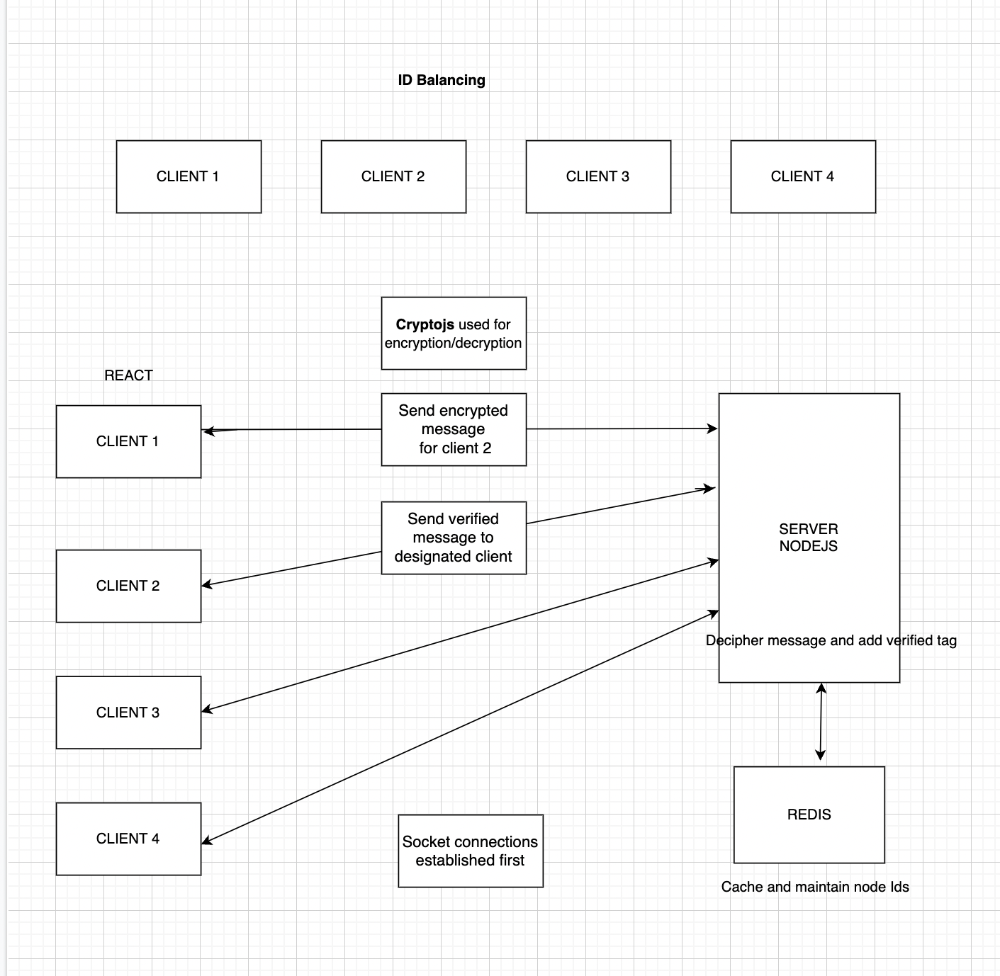

# **TRACEBLOC assignment**

Our front-end sends a number of rest api requests to our back-end app service on a regular interval to get the latest updated data. Due to which the server is always under heavy load.
The Engineering team came up with an idea to send the changes from the server to the client whenever required. You are given the responsibly to create a demo for this idea.

Your task is to build a NodeJS app that will send messages to the front-end client whenever there is a new message received.

- There are 4 clients which sends encrypted messages to each other through the back-end.
- A client sends a json to the backend which has a message encrypted for a specific client:

{
message: “an encrypted data”,
client: 2,
timestamp: “Friday Feb 25-2022 19:50:23 GMT+0200”
}

- The backend decrypts the message, adds a VERIFIED tag and sends the json to the specific client:

{
message: “an encrypted data::VERIFIED”,
client: 2,
timestamp: “Friday Feb 25-2022 19:50:23 GMT+0200”,
}

- The client specified in the json decrypts it and prints the message as VERIFIED or UNVERIFIED.

## `Architecture`

The app follows a socket based architecture with id balancing and redis caching to store the client node states.

The message sending, encryption and decryption happens all in real time and the architecture is scalabale to more than 4 clients as well.

## Available Scripts

for `client` you can run

### `npm run start`

each new tab represents a new client with a given id ( max limit 4 )

for `server` you can run

### `nodemon index.js`

Runs the server in the development mode at [http://localhost:1880](http://localhost:1880)

once the server and client are up and running you can go to [http://localhost:3000](http://localhost:3000) to start using the app.
